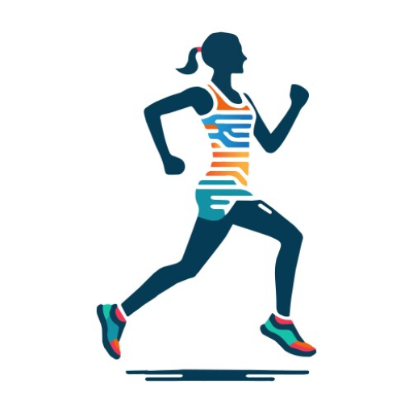
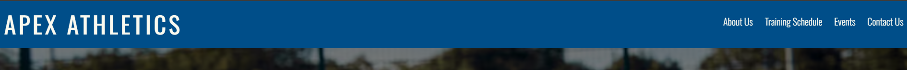
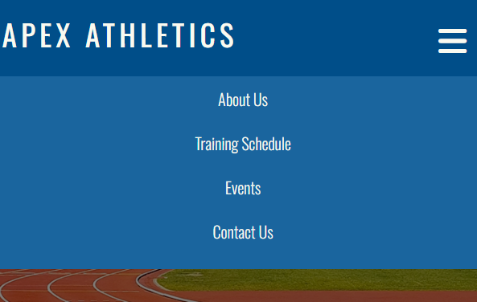

# Apex Athletics Website 
Apex Athletics is designed for individuals of all ages seeking coaching in their chosen athletic disciplines, regardless of skill level. It also provides users with information on track meets and events.
Furthermore,the website design ensures a user-friendly and accessible experience for all potential visitors.

[View Apex Athletics Website on GitHub Pages](https://augustinagonja.github.io/apex-athletics/)

## User Experience (UX) :
### Project Expectations :
The final output for this project is a three-page website consisting of the following:

* Homepage: Filled with information about the club, its aims, and offerings.
* Schedule Page: Featuring a timetable of training sessions along with details of upcoming events.
* Contact Page: Allowing users to register for training or events while providing general contact information for those seeking further details.

### User Stories :
Considering all potential users of the website, their needs, expectations, and the features they might be looking for, I will focus on implementing these elements effectively as a developer.

**First Time Visitor :** 

"As a Potential Visitor, I want to learn about the club so that I can decide if I want to join."
Acceptance Criteria: 

* Homepage providing clear overview of club's offerings.
* An "About" section with relevant details. 
* Clear call-to-action button for joining the club.

Tasks:
* Create an attractive homepage using HTML and CSS elements.
* Write an engaging "About Us" section that highlights the club's mission, goals, and the motivations driving its members.
* Create a call to action button linking to a registration form.
---
**Prospective Athlete:**

"As an Athlete looking for a place to train, I want to browse through the available training programs so that I can determine the best fit for myself."

Acceptance Criteria : 
* A "Training & Programs" page listing all available training programs/activites.
* Information about schedules displayed.
* There is an option to sign up for a membership.

Tasks:
* Create "Training and Schedules" page highlighting all ongoings.
* Use customised Bootstrap grids to create a cohesive layout for training Schedules.
* Use HTML elemments to create a sign up form.
* Form to include general contact inputs and dropdown/radio button with selectable options for user.
---
**Returning Visitor :** 

"As a Returning Member, I want to contact the club and ask specific questions about upcoming events and more."

Acceptance Criteria : 
* An "Upcoming Events" section displaying the latest events.
* Event details, including dates and locations, are visible.
* "Contact Us" section with Sign Up form for mailing list (This will notify users of future events).

Tasks :
* Create an "Upcoming Events" page accesible from homepage.
* Use Bootstrap for the clear layout of the events page.
* Links to social media embedded in fixed footer. 
* Create a mailing list taking email as input - "Sign up for News and Updates".
---
**Potential Member:**

"As a Potential Member, I want to contact the club so that I can ask specific questions."

Acceptance Criteria:
* A "Contact Us" form is available with fields for name, email, and message.
* The club’s location is shown on a map.
* Social media links are included for alternative contact options.

Tasks:
* Design and implement a "Contact Us" page with a form (name, email, message).
* Integrate an embedded Google Map to show the club's location.
* Add social media icons linking to external platforms.
---
**General Web User**

"As a web user , I expect the website to be easy to navigate, responsive and user-friendly across all devices"
Acceptance Criteria:
* Layout is responsive to all screen sizes.
* The navigation menu is mobile-friendly.
* Buttons and links are easy to tap.

Tasks:
* Implement a mobile-friendly navigation menu (hamburger menu on smaller screens).
* Use CSS Flexbox to ensure content adapts to different screen sizes.
* Ensure buttons, links, and forms are touch-friendly.

## Design

### Colour Scheme 
I used the website ["Coolors"](https://coolors.co/) to select my color scheme.

A selection of natural tones, featuring **various shades of blue.**  
To bring energy and vibrancy to the site, **yellows, oranges, and whites** are included.
This will capture the core themes of **speed, athleticism, and power** while maintaining a balanced and harmonious feel.

### Typography
All fonts on this website are imported from "Google Fonts". To enhance its sporty,sleek and impactful design, the primary font is **"Oswald".** which offers a range of font weights. As a fallback, **Montserrat** is used to maintain a modern, clean aesthetic while ensuring readability. If neither font loads, a generic **sans-serif** will be applied. 

**CSS Code --> font-family: "Oswald" ,Montserrat, sans-serif;**

 
### Imagery
The site's imagery will feature track athletes running, jumping, and throwing, highlighting individuals of various ages and abilites.

*All images will be linked to their original source in the credits section.*

### Wireframes
Wireframes below created using "Balsamiq".
Each page has its own wireframe as displayed on different screen sizes.

Homepage Wireframe

 

Training Schedule Page Wireframe

 

Contact Page Wireframe

 

## Features 
My website is fully responsive across all screen sizes, ensuring optimal viewing and functionality on devices ranging from mobile phones to desktops.

The website consists of three pages: the Home Page, the Training & Schedules Page, and the Contact Page.

**Favicon:**

**Navigation Bar:**

It features a functional navigation bar.

On desktop devices, the full menu is visible, allowing users to easily click and interact with the menu items.

On phones and tablets, the menu is replaced by a burger icon. When clicked, it expands to display the menu items stacked vertically for better accessibility on smaller screens.

**Footer:**

The footer remains consistent across all screen sizes, with its contents adjusting in size to fit the full width of the browser.

**Home Page:**

The homepage features a carousel showcasing images of club members. Users can navigate through the slideshow using side toggles, although it progresses automatically. Following this, an "About Us" section highlights the club's goals and facilities. The subsequent section elaborates on the club's offerings, using a combination of icons and text to effectively convey information to users.

**Training Schedule Page:**

The training schedule page welcomes users with a hero image. The first section outlines the timetable, featuring several tables that correspond to each day of the week and list all available training sessions. Multiple "Register" buttons are included, redirecting users to the contact page with a sign-up form. Following this, the "Upcoming Events" section presents information through cards, each containing an image and a brief description.

**Contact Page:**

The contact page features a matching hero image. It includes a registration form where users must enter their information, with validation requiring a name, email, and phone number. The page concludes with general contact details, including the club's address, phone number, and email.

### Future Implementation:**

If I were to return to this project I would like to :

* Create a more dynamic first page with a few additional engaging sections.
* Add a testimonials section featuring feedback from participants of various classes.
* Include a mailing list sign-up option, allowing users to receive updates about events or classes without extra effort.
* Enable users to create their own accounts, making event and class sign-ups quicker by saving their information.
* Improve the interactivity and readability of the tables on the second page.
* Enhance accessibility across all pages, considering features like color-blind-friendly designs.

I believe these improvements would fully enhance the overall user experience of my website.
## Testing
*please refer to [testing.md](testing.md) document.This will outline all of the testing and debugging processess*
## Technologies Used

**Languages:**

This project only required the use of HTML and CSS.

## Frameworks, Libraries & Programs Used
- Balsamiq - To build page by page wireframes.

- Git & Github - Version control ,saving and storing files for the site respectively.

- VSCode - The coding environment used to create the site.

- Bootstrap library - For layouts and specific features (Carousel , Tables).

- Google Fonts - To import the fonts used on the website.

- ChromeDevTools - To troubleshoot and test features, solve issues with responsiveness and styling.

- Favicon.io - To create favicon.

- Am I Responsive? - To show the website image on a range of devices.

- Shields.io - To add badges to the README

# Credits & Code Used
* I drew significant inspiration from the [Love Running - Essentials Project](https://learn.codeinstitute.net/courses/course-v1:CodeInstitute+LRFX101+6/courseware/e805068059af42af87681032aa64053f/1da6ad13213740f1855a51d30a2375b1/). This example was particularly helpful as the Love Running website addresses a similar fitness and sports theme to my own.The walkthrough provided essential guidance, especially in helping me develop a responsive navigation bar and very basic page structure including the footer.

* I frequently used [Stack Overflow](https://stackoverflow.com/questions) to find solutions to specific coding questions and explore discussions around similar issues I encountered while writing my code. Additionally, I referred to [W3Schools](https://www.w3schools.com/html/default.asp) for more general queries and foundational information.

* YouTube was also a valuable resource. I specifically used this [Tutorial](https://www.youtube.com/watch?v=zVjAA6UxvtU&t=318s) to learn how to style images within the carousel and position them effectively. Another [Tutorial](https://www.youtube.com/watch?v=fNcJuPIZ2WE) helped me understand form handling and the process that occurs after submission.

* [Favicon Generator used to produce Favicon image](https://favicon.io/favicon-converter/)

* [FontAwesome] https://fontawesome.com/
# Content
All written content, including the text on tables and cards, was composed by me. I used Grammarly as an assistant to enhance the flow and readability of the text.
# Media

**Images**
[Favicon Image](https://cdn.vectorstock.com/i/500p/17/70/runner-fitness-club-marathoner-sportsman-vector-54691770.jpg)

[Carousel Image 1](https://www.google.com/url?sa=i&url=https%3A%2F%2Fm.facebook.com%2Fstory.php%3Fstory_fbid%3D122162818562107351%26id%3D61553220544140&psig=AOvVaw1hZhRFiI4Wc6eBFUOqtkzc&ust=1740418335240000&source=images&cd=vfe&opi=89978449&ved=0CBAQjRxqFwoTCNDow9yp2osDFQAAAAAdAAAAABAE)
[Carousel Image 2](https://images.ctfassets.net/yixw23k2v6vo/7Meixc73F8E8n3uaHC5BQH/b3aecc8f6eabf9a845f5a8af9fe020cd/iStock-1256376179.jpg)
[Carousel Image 3](https://lens.usercontent.google.com/image?vsrid=CP6MpdGDr4iKXhACGAEiJDJmZGU1NWExLWNhNzItNGYwZS04OTk4LTM5MzFhMjIwNjcyZQ&gsessionid=VT72tKOYTGOEUTfK6ZjFq0YnTqFZfO0TubuKYgh8CJEKJgQ4wJDbiA)

[Hero Image 1](https://www.google.com/url?sa=i&url=https%3A%2F%2Fwww.du.edu%2Fsport-sense&psig=AOvVaw1rMNjLVtsLWZZK9uuLE9GK&ust=1740419010077000&source=images&cd=vfe&opi=89978449&ved=0CBAQjRxqFwoTCPjCg6Gs2osDFQAAAAAdAAAAABAJ)

[Card Image 2](https://i.guim.co.uk/img/media/034a765000e883ee9f485a77d1b2bcd6edf6589c/0_55_3648_2189/master/3648.jpg?width=465&dpr=1&s=none&crop=none)
[CardImage 3](https://a.espncdn.com/photo/2024/0718/r1360186_1296x729_16-9.jpg)

[Hero Image 2](https://www.google.com/url?sa=i&url=https%3A%2F%2Fwww.sif.health%2Fblog%2Fnotifications-and-reminders-hints-and-tips&psig=AOvVaw0sysmkUNYmF6RgFDzwUPhV&ust=1740419163904000&source=images&cd=vfe&opi=89978449&ved=0CBAQjRxqFwoTCMiZx-Ss2osDFQAAAAAdAAAAABAE)
