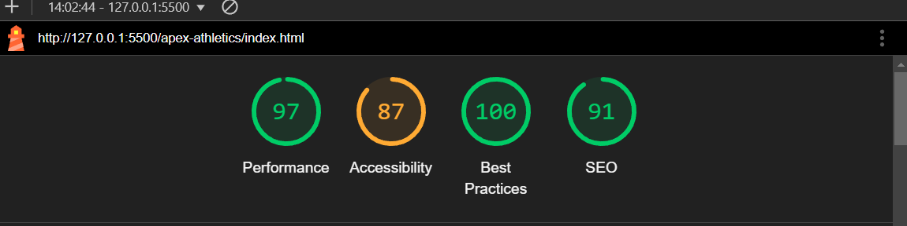
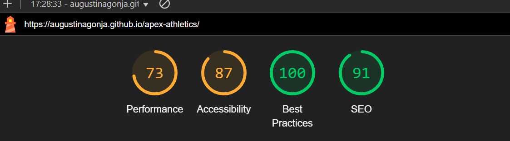
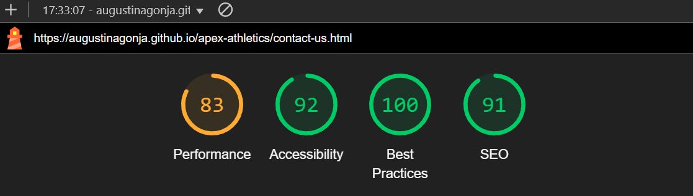
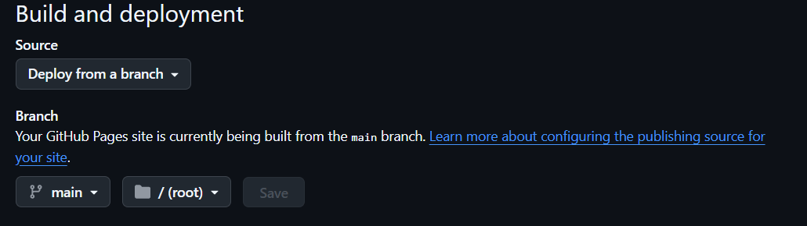
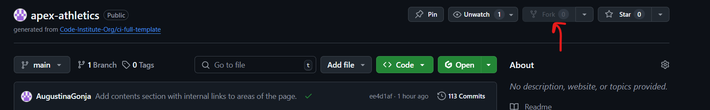
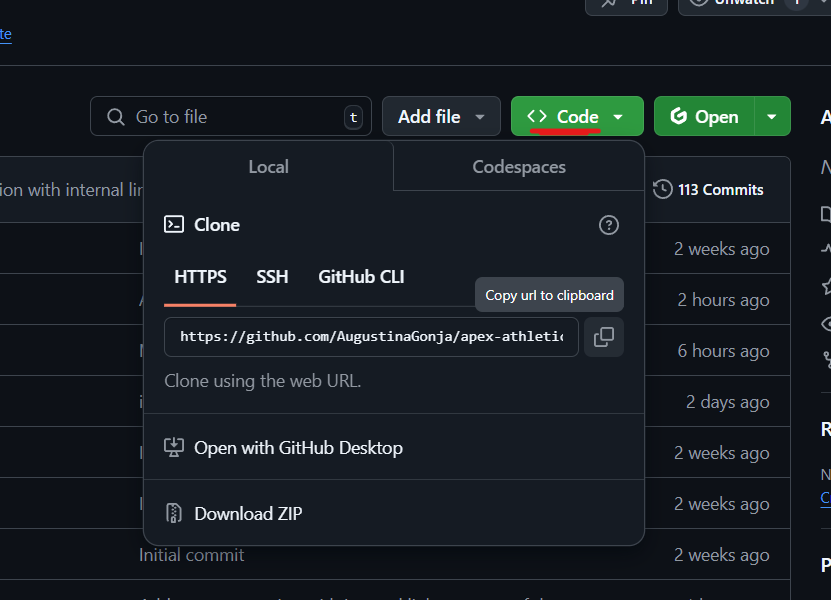

# Apex Athletics - Testing 
I primarily used Chrome DevTools to test how my code would function, experimenting with different inputs through trial and error to find better solutions. This process helped me troubleshoot obvious issues I wasn’t initially sure how to fix. It was also an effective way to assess how responsive my webpage was.

I applied this method to all three pages. During the process, I discovered several bugs that I hadn’t noticed while writing the code.

Using the W3C Validator was particularly helpful in identifying these issues. Some errors were consistent across all pages since I had copied the generic layout into each one.

## Contents
**[Automated Testing](#automated-testing)**
* [Html Validator](#wc3-html-validator)
* [CSS Validator](#wc3-css-validator)

**[Performance Testing](#performance-testing-lighthouse)**
* [Desktop](#desktop)
* [Mobile](#mobile)

**[Performance Results](#performance-results)**

**[Manual Testing](#manual-testing)**
* [Testing User Stories](#testing-user-stories)

**[Full Testing](#full-testing)**
* [Devices Tested On](#devices-tested-on)
* [Page Feature Testing](#page-feature-testing)

**[Known & Solved Bugs](#known--solved-bugs)**

**[Deployment & Local Development](#deployment--local-development)**

## Automated Testing
### WC3 HTML Validator
- [index.html](testing/Examples/index-html-validator.png) **Passed**
- [training-schedule.html](testing/Examples/index-html-validator.png) **Passed**
- [contact-us.html](testing/Examples/index-html-validator.png) **Passed**

The most consistent issues I found across all my .html pages are as follows:
- Trailing slash on void elements. 
  [Example](testing/Examples/trailing-slash-error.png) 
  This issue mainly arose due to the "Prettier - Code Formatter" which tends to add unnecessary slashes to self-closing elements like line breaks.

- Bad value for attribute src on element img. 
[Example](testing/Examples/Bad-value-for-attribute-error.png)
This occurred due to spaces between characters in the image file names.
### WC3 CSS Validator
- [style.css](testing/Examples/style-css-validator.png) **Passed**
- [style-2.css](testing/Examples/style-2-css-validator.png) **Passed**
- [style-3.css](testing/Examples/style-3--css-validator.png) **Passed**  

**Note:** 
When I first entered the code into the validator, there was an error in the style-3.css file. 
[See Error Message](testing/Examples/style-3-css-validator) 
I removed a line from the CSS styling, as it had no impact on the final output. After doing so, I ran the code through the validator again, and it passed, as mentioned above.

---
Overall ,the most consistent issues I found across all my .css pages are as follows:

- Imported Stylesheets are not checked. [Example](testing/Examples/css-warning.png)
Indicates that the validator does not validate imported stylesheets, such as Google Fonts - Not an error as such.

*All HTML and stylesheets passed validation.*

## Performance Testing (Lighthouse)
Chrome DevTools Lighthouse was used to test each webpage's performance, accessibility, best practices, and SEO.

I noted that:

#### "Chrome extensions negatively affected this page's load performance. Try auditing the page in incognito mode or from a Chrome profile without extensions."

I noticed that my mobile performance was most impacted, particularly on the second page.

In terms of accessibility, all pages—both desktop and mobile—scored 84 or higher.
Areas for improvement include:

* Attaching descriptive names to social media links.
* Improving the contrast ratio between background and foreground colors.

**Wave Contrast Checker** 

[index.html Contrast Check](testing/Examples/contrastcheck-1.png)

[training-schedule.html Contrast Check](testing/Examples/contrastcheck-2.png)

[contact-us.html Contrast Check](testing/Examples/contrastcheck-3.png)

Best Practices and SEO's scored 100 and 91 respectively across the board.

## Performance Results
### Desktop 
- Index Page

- Training Schedule Page

- Contact Page

### Mobile
- Index Page

- Training Schedule Page

- Contact Page

## Manual Testing
### Testing User Stories

| **User Story** | **How are they achieved?** | **Image** |
| :--- | :--- | :--- |
|`Potential Visitor` "As a Potential Visitor, I want to learn about the club so that I can decide if I want to partake in any training or events"|The homepage provides a clear overview of club's offerings and a clear "About Us" section.|[About-Us](assets/images/about-us.png) |
| `Prospective Athlete` "As an Athlete looking for a place to train, I want to browse through the available training programs so that I can determine the best fit for myself." |The "Training Schedule" page provides a list of all available training programs, including their days, times, and corresponding ability levels.|[Training](assets/images/schdule.png) |
|`Returning Visitor`  "As a Returning Member, I want to contact the club and ask specific questions about upcoming events and more."|The "Upcoming Events" section displays all events and includes a "Register Here" button, which directs users to a sign-up form.|[Events](assets/images/events.png)|
|`Potential Member`  "As a Potential Member, I want to contact the club so that I can ask specific questions."|As mentioned above a contact section is included in the webpage , however I didnt include a location map as it wasn't a priority|[Form](assets/images/form.png)|
|`General Web User`  "As a web user , I expect the website to be easy to navigate, responsive and user-friendly across all devices" |The webpage has been tested using Chrome DevTools to ensure basic responsiveness across different devices. Additionally, the navigation bar features a clear menu, making it easier for users to navigate the site.|[AmiResponsive](assets/images/Titleimage.png) |
## Full Testing
### Devices Tested On

Laptop

* Lenovo Legion 5 15.6 in

Mobile

* Iphone 14 SE - Safari

Browser
* Google Chrome
* Microsoft Edge

### Page Feature Testing

| Feature | Expected Outcome | Testing Performed | Result | Pass/Fail |
| --- | --- | --- | --- | --- |
| Sites title | Link directs the user back to the home page | Clicked title | Home page reloads | Pass |
| About Us Menu Item | Directs user to the "About Us Section" on Homepage | Clicked Item | Page moves down to "About Us" Section | Pass |
| Social Icon Links | Directs user to login page to social media site in a new tab | Clicked on Icon |New tab opens with homepage for Social media page | Pass |
| Training Schedule , Events and Contact Menu Items | Directs user to the respective page or section it corresponds to | Clicked Item | New page with specific content| Pass |
| Register Here Button | Directs the user to the Contact Us page | Clicked on button | Directs the user to the Contact Us page | Pass |
| Form Validation | Does'nt allow user to submit form without filling in required fields | Submitted empty form | "Please Fill in this Field" Message pops up  | Pass |
| Register Button | Directs the user to the form submission page | Clicked on button | Directs the user to the form submission page | Pass |

# Known & Solved Bugs

Below, I have highlighted the bugs I identified and the fixes I implemented. I’ve also marked the bugs that remain unresolved on the webpage, for which I couldn't find fixes.

| Bug | Problem | Fix | Result |
| --- | --- | --- | --- |
| The footer icons are not centered within the div; they appear to be aligned closer to the top of the footer | Default margin set to 16px | Add margin property to #social and set to 0px | Footer icons are now centered within div |
| On the 2nd Page , the vertical table separator lines are misaligned, and the table cells are not uniformly sized across the tables. | Default style from Bootstrap | Target the entire table in Stylesheet , add the property "table-layout" and set it to "fixed". Stack Overlow [Help Article](https://stackoverflow.com/questions/21495634/how-to-make-a-table-with-equal-column-widths-in-css)| Table columns are now equal width, no misalignment |
| On the 2nd Page, the "Register" buttons on the cards are and become signinficantly misaligined especially on tablets.| Default style from Bootstrap | I added bootstrap positioning to html code, then adjusted my margins in css| Register buttons are aligned on all screen sizes |
| On the 3rd Page, At smaller screen sizes the select button would overflow the form area | Unsure | I edited the width of the select boxes in css so that it would fit on at least the smallest plausible screen size for a smartphone 320x480px. | **Unresolved/Temporary Fix** for screen widths below 260px the boxes overflow again|
| No confirmation message for form on 3rd page - when submitted form goes to a "HTTP ERROR 405" | action="" had no URL so form not being submitted anywhere and with method: POST the browser cant render the request. | Create form.html page and add this to the action attribute (When form submitted user will be sent there) and method: GET will send user to the linked page in the site.I used [This Youtube Tutorial on Forms](https://www.youtube.com/watch?v=fNcJuPIZ2WE).| User is directed to a "Thank you for submitting your response"  page, with an option to click a button which will sen yoy back to the form |

# Deployment & Local Development
**Deployment Process**

The process to deploy my page on GITHUb pages was fairly straightforward

Below are the steps I took:

* Find the [Repo for Apex Athletics ](https://github.com/AugustinaGonja/apex-athletics)
* Go to Settings (situated on the top menu)
* Once in Settings find the "Code and automation" heading on the left hand side and navigate down to "Pages"
* Go to "Build and deployment". 
* In the "Source" dropdown select "Deploy from a branch".Then in the "Branch" dropdowns select "main" and "/(root)"respectively and save.

* Go back to main page in repo and wait a couple of minutes before refreshing.
* On the right hand side there should be a heading called "Deployments" , click this to view your deployed website.

### Local Development

**How to Fork**

Process of copying a repo to another GitHub account allowing for collaboration. Changes wont affect the original unless pushed. 
* Login to Github and locate the repo for Apex Athletics.
* Find the Fork Button. 

**How to Clone**

Process of copying the repo into your machine.
* Log in to GitHub and find the Apex Athletics repo.
* Click the Code dropdown, select HTTPS, and copy the URL.

* In VSCode (or another editor), open a terminal and run - git clone followed by the url.
* Make changes, then push them to see the updates in the GitHub repo.
---
[Back to top](#apex-athletics---testing)

[Back to README](README.md)

---