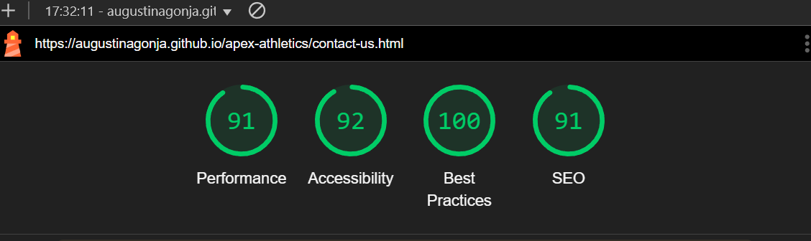
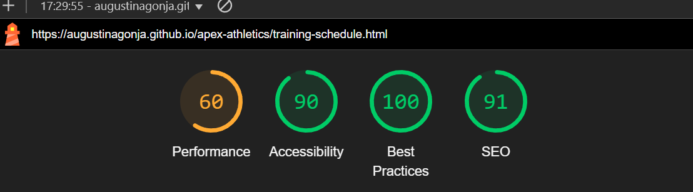

# Apex Athletics - Testing 
I primarily used Chrome DevTools to test how my code would function, experimenting with different inputs through trial and error to find better solutions. This process helped me troubleshoot obvious issues I wasn’t initially sure how to fix. It was also an effective way to assess how responsive my webpage was.

I applied this method to all three pages. During the process, I discovered several bugs that I hadn’t noticed while writing the code.

Using the W3C Validator was particularly helpful in identifying these issues. Some errors were consistent across all pages since I had copied the generic layout into each one.

# Automated Testing
## WC3 HTML Validator
- [index.html](testing/Examples/index-html-validator.png) - Passed.
- [training-schedule.html](testing/Examples/index-html-validator.png) - Passed.
- [contact-us.html](testing/Examples/index-html-validator.png) - Passed.

The most consistent issues I found across all my .html pages are as follows:
- Trailing slash on void elements. 
  [Example](testing/Examples/trailing-slash-error.png) 
  This issue mainly arose due to the "Prettier - Code Formatter" which tends to add unnecessary slashes to self-closing elements like line breaks.

- Bad value for attribute src on element img. 
[Example](testing/Examples/Bad-value-for-attribute-error.png)
This occurred due to spaces between characters in the image file names.
## WC3 CSS Validator
- [style.css](testing/Examples/css-warning.png) - Passed
- [style-2.css]() - Passed
- [style-3.css]()  - Passed  
  Error Found in style-3.css : baseline is not a justify-content value : baseline.

  [Example](testing/Examples/style-3-css-validator) 
  Fix - Removed entire line from css form styling as removing did not affect final output.

The most consistent issues I found across all my .css pages are as follows:

- Imported Stylesheets are not checked. [Example](testing/Examples/css-warning.png)
Indicates that the validator does not validate imported stylesheets, such as Google Fonts - Not an error as such.

*All HTML and stylesheets passed validation.*

## Performance Testing - Lighthouse
Chrome DevTools Lighthouse was used to test each webpage's performance, accessibility, best practices, and SEO.

I noted that:

#### "Chrome extensions negatively affected this page's load performance. Try auditing the page in incognito mode or from a Chrome profile without extensions."

I noticed that my mobile performance was most impacted, particularly on the second page.

In terms of accessibility, all pages—both desktop and mobile—scored 84 or higher.
Areas for improvement include:

* Improving the contrast ratio between background and foreground colors.
* Attaching descriptive names to social media links.

Best Practices and SEO's scored 100 and 91 respectively across the board.

## Performance Results
## Desktop 
- Index Page

- Training Schedule Page

- Contact Page

## Mobile
- Index Page

- Training Schedule Page

- Contact Page

# Manual Testing
## Testing User Stories

| **User Story** | **How are they achieved?** | **Image** |
| :--- | :--- | :--- |
|`Potential Visitor` "As a Potential Visitor, I want to learn about the club so that I can decide if I want to partake in any training or events"|The homepage provides a clear overview of club's offerings and a clear "About Us" section.|[About-Us](assets/images/about-us.png) |
| `Prospective Athlete` "As an Athlete looking for a place to train, I want to browse through the available training programs so that I can determine the best fit for myself." |The "Training Schedule" page provides a list of all available training programs, including their days, times, and corresponding ability levels.|[Training](assets/images/schdule.png) |
|`Returning Visitor`  "As a Returning Member, I want to contact the club and ask specific questions about upcoming events and more."|The "Upcoming Events" section displays all events and includes a "Register Here" button, which directs users to a sign-up form.|[Events](assets/images/events.png)|
|`Potential Member`  "As a Potential Member, I want to contact the club so that I can ask specific questions."|As mentioned above a contact section is included in the webpage , however I didnt include a location map as it wasn't a priority|[Form](assets/images/form.png)|
|`General Web User`  "As a web user , I expect the website to be easy to navigate, responsive and user-friendly across all devices" |The webpage has been tested using Chrome DevTools to ensure basic responsiveness across different devices. Additionally, the navigation bar features a clear menu, making it easier for users to navigate the site.|[AmiResponsive](assets/images/about-us.png) |
## Full Testing
**Devices Tested On:**

Laptop

* Lenovo Legion 5 15.6 in

Mobile

* Iphone 14 SE

Browser

* Google Chrome
### Page Feature Testing:
| Feature | Expected Outcome | Testing Performed | Result | Pass/Fail |
| --- | --- | --- | --- | --- |
| Sites title | Link directs the user back to the home page | Clicked title | Home page reloads | Pass |
| About Us Menu Item | Directs user to the "About Us Section" on Homepage | Clicked Item | Page moves down to "About Us" Section | Pass |
| Social Icon Links | Directs user to login page to social media site in a new tab | Clicked on Icon |New tab opens with homepage for Social media page | Pass |
| Training Schedule , Events and Contact Menu Items | Directs user to the respective page or section it corresponds to | Clicked Item | New page with specific content| Pass |
| Register Here Button | Directs the user to the Contact Us page | Clicked on button | Directs the user to the Contact Us page | Pass |
| Form Validation | Does'nt allow user to submit form without filling in required fields | Submitted empty form | "Please Fill in this Field" Message pops up  | Pass |
| Register Button | Directs the user to the form submission page | Clicked on button | Directs the user to the form submission page | Pass |

# Known Bugs
- The footer icons are not centered within the div; they appear to be aligned closer to the top of the footer.

- The navigation bar menu uses a solid line text decoration on hover, displaying an underline. However, the underline appears slightly thicker or larger than the text.

- On the 2nd Page , the vertical table separator lines are misaligned, and the table cells are not uniformly sized across the table.

- On the 2nd Page, the "Register" button on the card is not centered within the card, which becomes more noticeable on smaller screen sizes.

- On the 2nd Page, the "Register" button on the last card is not aligned with the other two buttons.

- There is insufficient left spacing for the "Register" button and the select input on the form, affecting the overall alignment and readability.

- No confirmation message for form on 3rd page - when submitted form goes to "HTTP ERROR 405"

# Solved Bugs 
- *The footer icons are not centered within the div; they appear to be aligned closer to the top of the footer.*

   PROBLEM - Default margin set to 16px

   FIX - Add margin property to #social and set to 0px

- *The navigation bar menu uses a solid line text decoration on hover, displaying an underline. However, the underline appears slightly thicker or larger than the text.*

  PROBLEM - Margins and paddings.

  FIX - Adjusted paddings and margins in css.

- *On the 2nd Page , the vertical table separator lines are misaligned, and the table cells are not uniformly sized across the tables.*
  PROBLEM - Default style from Bootstrap.

  FIX- Target the entire table in Stylesheet , add the property "table-layout" and set it to "fixed".
  I found this Stack Overlow [Discussion](https://stackoverflow.com/questions/21495634/how-to-make-a-table-with-equal-column-widths-in-css) which helped me amend this.

- *No confirmation message for form on 3rd page - when submitted form goes to "HTTP ERROR 405"*

   PROBLEM - action="" had no URL so form not being submitted anywhere and with method: POST the browser cant render the request.

   FIX - Create form.html page and add this to the action attribute (When form submitted user will be sent there) and method: GET will send user to the linked page in the site.
   I used [This Youtube Tutorial on Forms](https://www.youtube.com/watch?v=fNcJuPIZ2WE) to find the solution.
# Deployment